

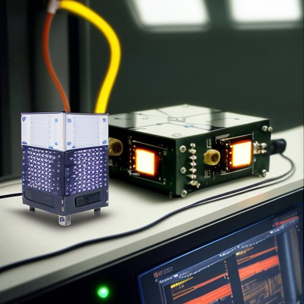
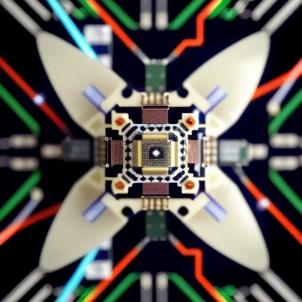
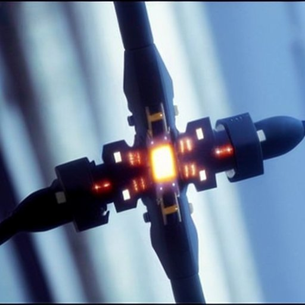
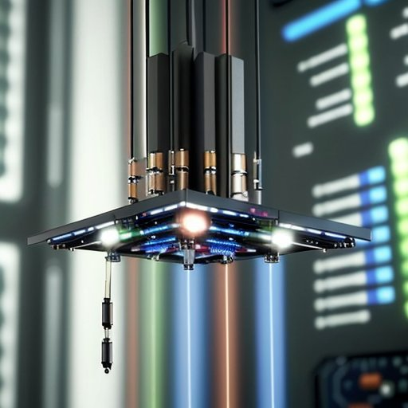
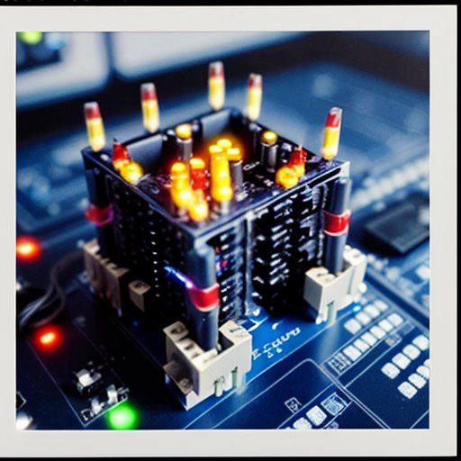
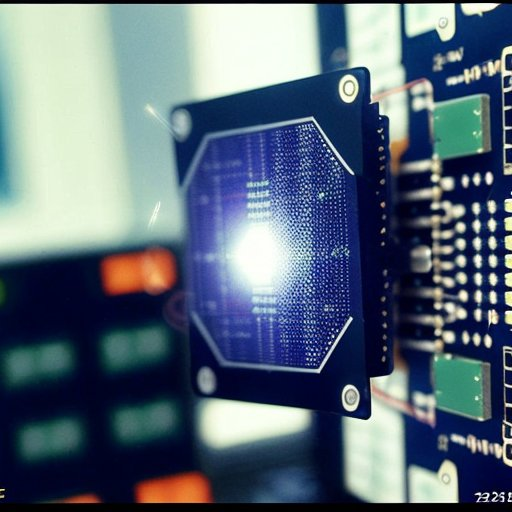
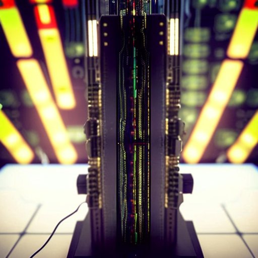

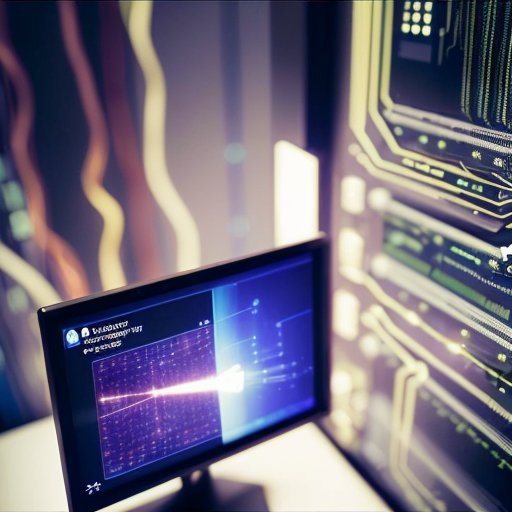
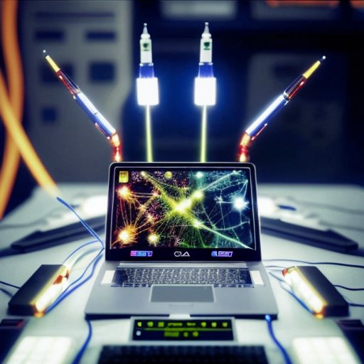
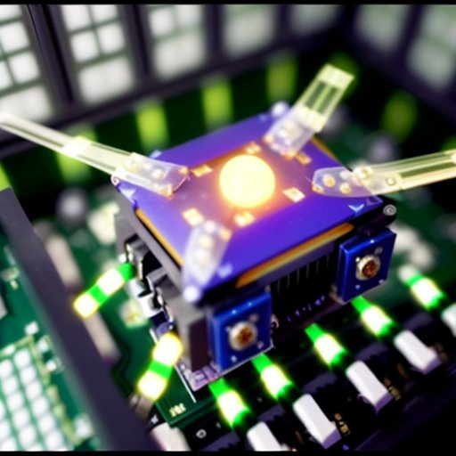
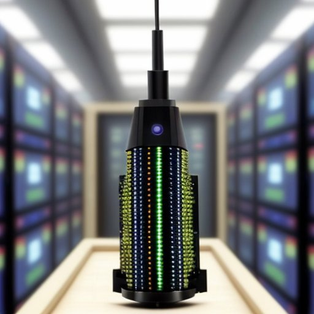
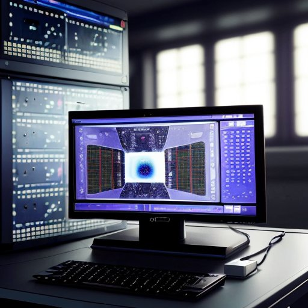
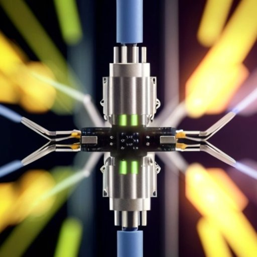
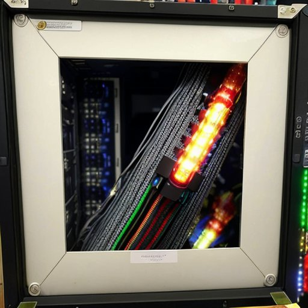
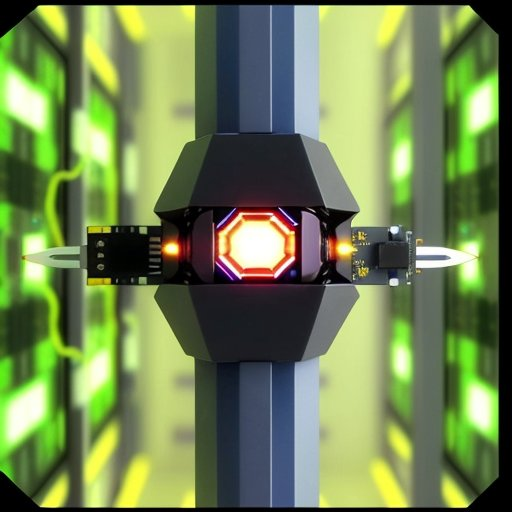
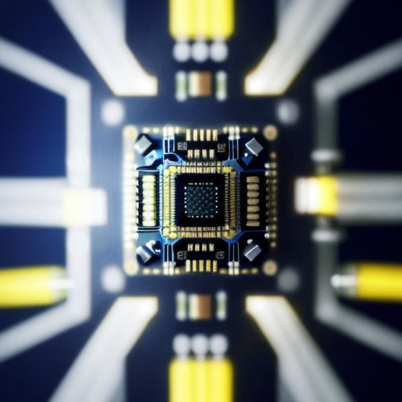
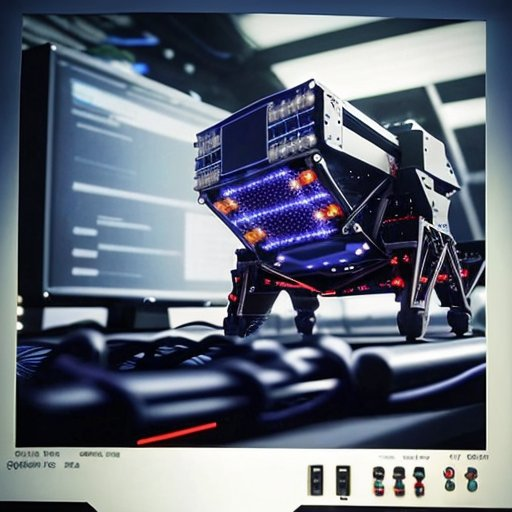
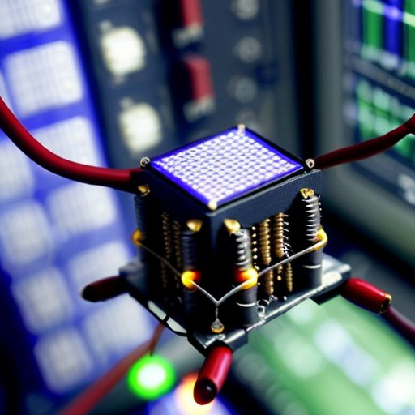

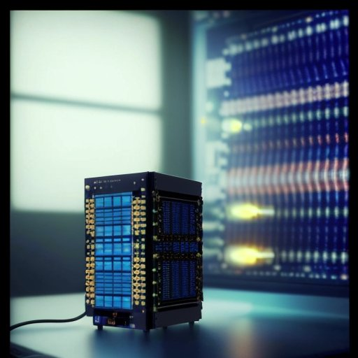
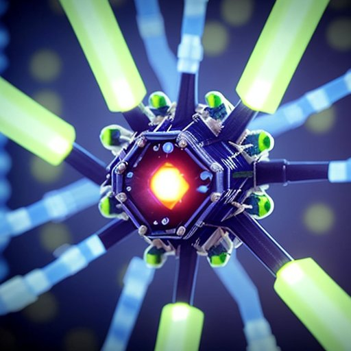
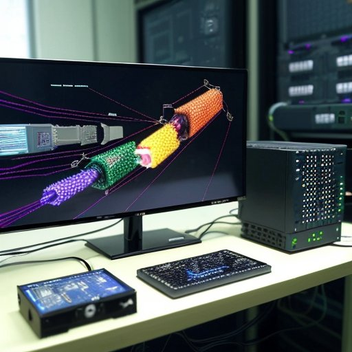

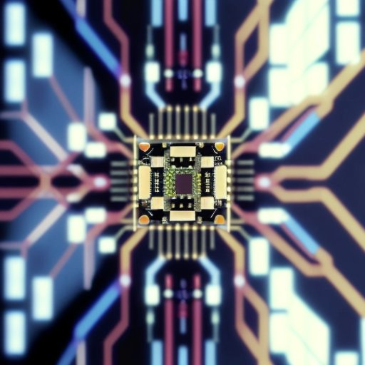
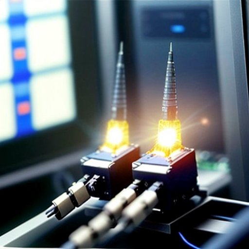
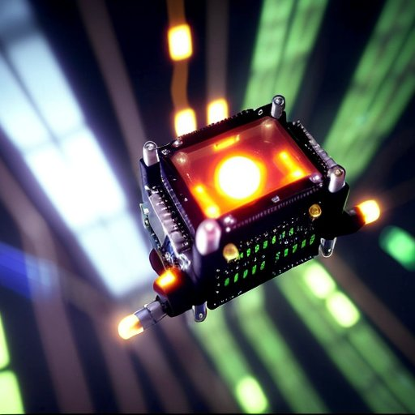
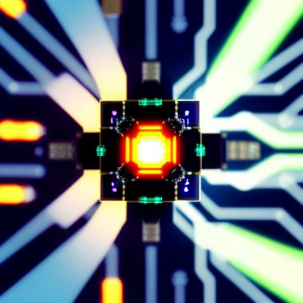

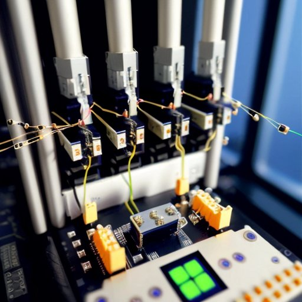
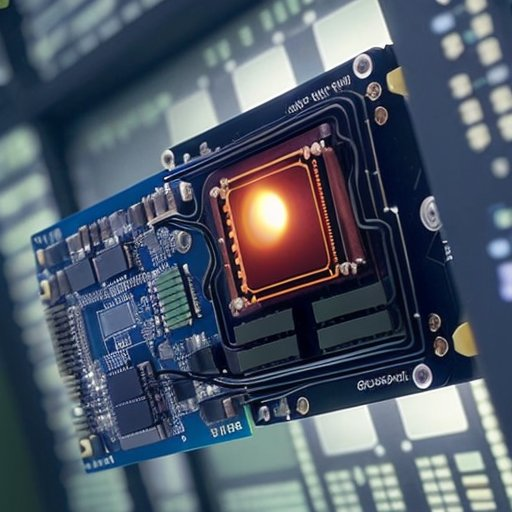
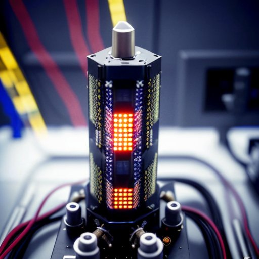
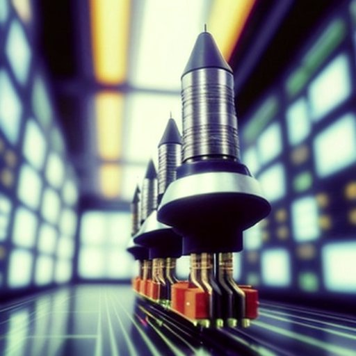
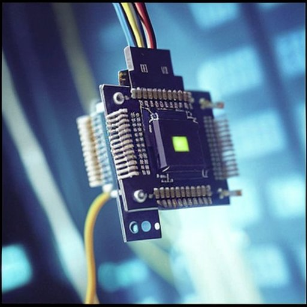
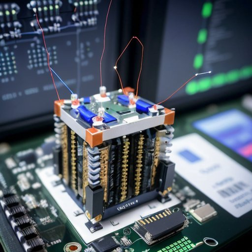
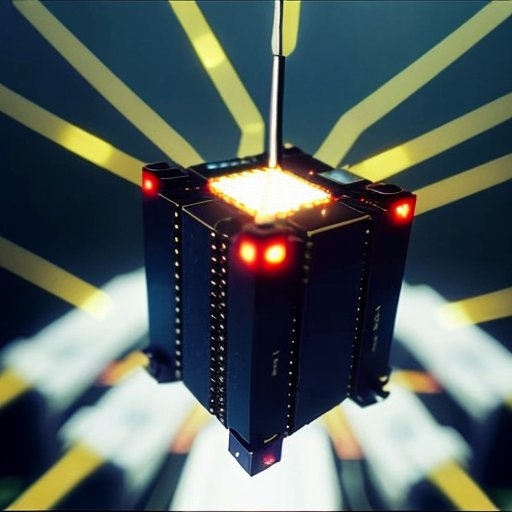
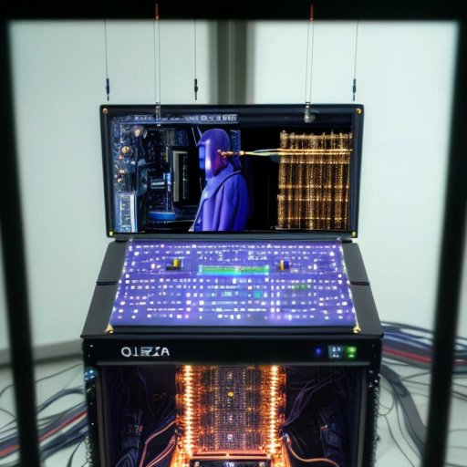
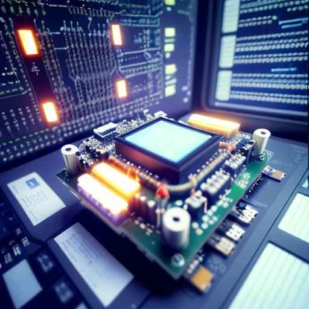
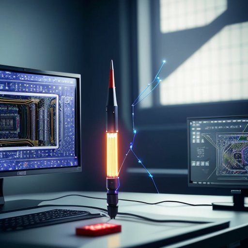
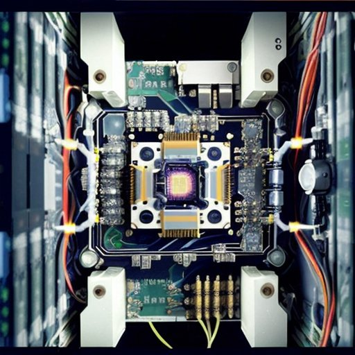

The visualizations above represent the enigmatic underpinnings of the Quantum Olza Protocol. Let these cryptic images serve as a guide through the mathematical labyrinth of quantum cryptography.

Return to the [Homepage](index.md) to continue your exploration.
